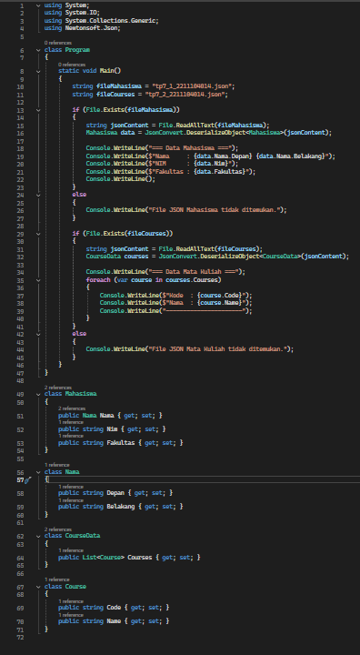
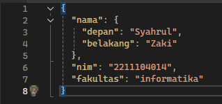
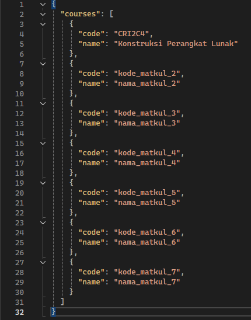
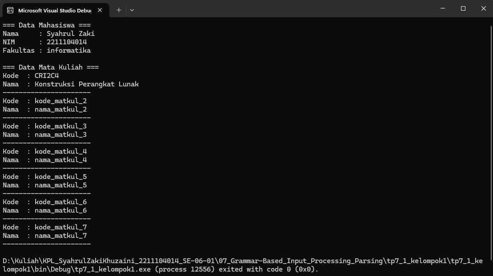

TUGAS PENDAHULUAN  
KONSTRUKSI PERANGKAT LUNAK  
 
MODUL I  
<!-- JUDUL -->
  

 

Disusun Oleh:  
Syahrul Zaki Khuzaini/2211104014  
SE-06-01  

 

Asisten Praktikum :  
Naufal El Kamil Aditya Pratama Rahman  
Imelda Alfina Palupi Dewi  

 

Dosen Pengampu :  
Yudha Islami Sulistya, S.Kom., M.Cs  

 

PROGRAM STUDI S1 REKAYASSA PERANGKAT LUNAK  
FAKULTAS INFORMATIKA   
TELKOM UNIVERSITY PURWOKERTO  

## Implementasi kode
Program.cs:  
 
tp7_1_2211104014.json: 
 
tp7_2_2211104014.json: 
 

## Output

## Penjelasan
File Program.cs akan membaca dua file JSON, yaitu tp7_1_2211104014.json, yang berisi informasi mahasiswa, dan tp7_2_2211104014.json, yang berisi daftar mata kuliah. Data dari kedua file tersebut akan ditampilkan di terminal menggunakan kelas Mahasiswa untuk merepresentasikan informasi mahasiswa, serta CourseData dan Course untuk daftar mata kuliah. Proses deserialisasi JSON ke objek C# dilakukan dengan bantuan pustaka Newtonsoft.Json.